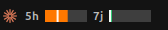
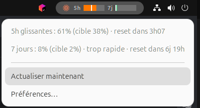
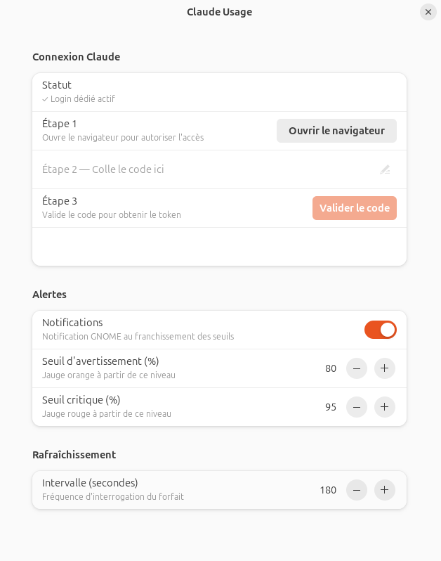

# Claude Usage — jauges de forfait dans la barre GNOME

Extension GNOME Shell affichant en permanence, dans la barre du haut d'Ubuntu, la
consommation du **forfait Claude** (abonnement Pro/Max) :

- **2 jauges** : fenêtre glissante **5h** et fenêtre **7 jours** (barres de progression colorées) ;
- **cadence cible** sur le 7j : un marqueur indique où vous *devriez* en être, pour repérer si vous consommez trop vite ;
- **détail au clic** : pourcentages exacts, heures de reset, indicateur de cadence ;
- **alertes** : couleur (vert / orange / rouge) + notification GNOME aux seuils, **désactivables** dans les préférences.



<details><summary>Menu détail & Préférences</summary>





</details>

## Prérequis

- Ubuntu avec **GNOME Shell 46+**.
- `python3`, `curl`, `libglib2.0-bin` (présents par défaut sur Ubuntu).
- Un **compte Claude Pro/Max** + l'une de ces sources de token (voir [Authentification](#authentification)).

## Installation

```bash
git clone https://github.com/quiche-lorraine/gnome-claude-usage.git
cd gnome-claude-usage
./install.sh        # ou : make install
```

Puis, **sous Wayland** (session Ubuntu par défaut), **déconnectez-vous / reconnectez-vous une fois**
pour que GNOME Shell charge l'extension. (Sous X11 : `Alt+F2` → `r`.)

Mise à jour : `git pull && make install`.
Désinstallation : `make uninstall`.

## Authentification

L'extension a besoin d'un token OAuth Claude. Elle en accepte **deux sources** (dans cet ordre) :

1. **Login dédié à l'extension** (recommandé, marche pour tout le monde) :
   ouvre les préférences (menu de l'extension → **« Connexion / Préférences… »**, ou
   `gnome-extensions prefs claude-usage@quiche-lorraine.github.io`), section **Connexion Claude** :
   1. **Ouvrir le navigateur** → tu autorises l'accès sur `claude.ai` ;
   2. **colle le code** affiché dans le champ prévu ;
   3. **Valider le code**.

   Le token est stocké dans `~/.config/gnome-claude-usage/credentials.json` et
   **rafraîchi automatiquement** par l'extension.

   <details><summary>En ligne de commande (alternative)</summary>

   ```bash
   python3 ~/.local/share/gnome-shell/extensions/claude-usage@quiche-lorraine.github.io/oauth-login.py
   ```
   </details>

2. **Token de Claude Code CLI** : si `~/.claude/.credentials.json` existe (CLI connecté),
   l'extension l'utilise sans login supplémentaire. Il reste frais tant que tu lances Claude Code
   de temps en temps.

> **Claude Desktop** n'est **pas** une source utilisable : il s'authentifie via une session web
> `claude.ai` (cookies chiffrés), pas via le token OAuth qu'attend l'endpoint. Les devs qui n'utilisent
> que Desktop doivent faire le **login dédié** (option 1).

## Réglages

```bash
gnome-extensions prefs claude-usage@quiche-lorraine.github.io
```

- Connexion Claude (login dédié en 3 étapes, voir [Authentification](#authentification))
- Notifications activées / désactivées
- Seuils d'avertissement (défaut 80 %) et critique (défaut 95 %)
- Intervalle de rafraîchissement (défaut 180 s)

## Comment ça marche

- `oauth-login.py` gère le login dédié (flux PKCE) ; les préférences l'appellent en deux temps
  (`--prepare` pour l'URL d'autorisation, `--complete <code>` pour l'échange du code).
- `resolve-token.py` fournit un access token : credentials dédiés (avec refresh auto), sinon repli
  sur le token du CLI.
- `usage-fetch.sh` interroge `GET https://api.anthropic.com/api/oauth/usage` (les mêmes chiffres
  que `/usage`), avec un **cache disque** (`~/.cache/gnome-claude-usage/`, TTL 120 s) qui sert la
  dernière valeur connue en cas d'erreur/429.
- `pace.py` normalise la réponse et calcule la cadence 7j en **jours ouvrés** (Europe/Paris).
- L'extension lit ce JSON toutes les ~180 s et met à jour les jauges.

> ⚠ L'endpoint OAuth et le flux de login ne sont **pas documentés** par Anthropic et peuvent changer ;
> le login réutilise le client OAuth public de Claude Code. Toute la logique est isolée dans
> `resolve-token.py` / `oauth-login.py` / `usage-fetch.sh`. En cas d'erreur, les jauges affichent
> « indisponible » sans planter le shell.

## Dépannage

```bash
make test         # teste la collecte de données seule (hors GNOME)
make test-mock    # données factices (vérifie couleurs + notifications)
make logs         # journaux GNOME Shell filtrés sur l'extension
```

- *Jauges « indisponible »* : pas de token → faites le **login dédié** (voir Authentification),
  ou lancez Claude Code si vous utilisez le token CLI. Vérifiez avec `make test`.
- *Extension absente après install* : relog Wayland nécessaire ; vérifiez
  `gnome-extensions info claude-usage@quiche-lorraine.github.io`.
